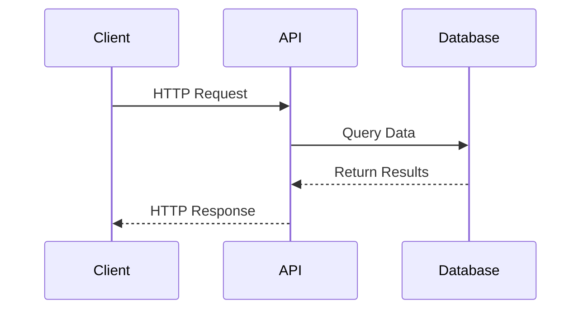
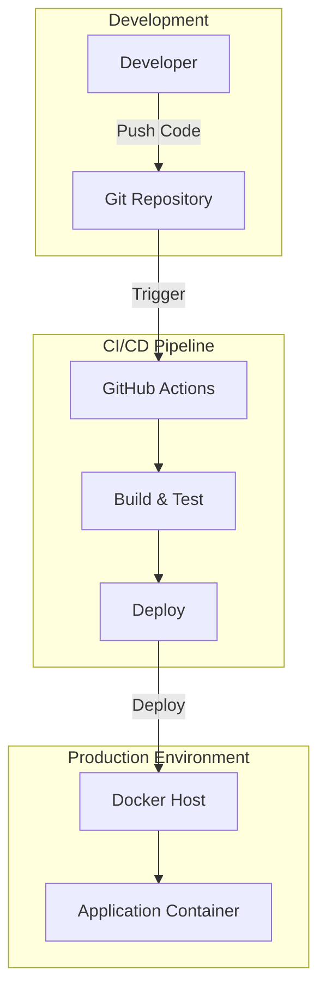

# System Architecture Document

## Project Overview
**Repository:** undefined
**Language:** nodejs
**Request:** Create a detail architecture of the chemical industry with the risk factor. My Application is in Java, database is mongodb and also need middleware for that.

## Executive Summary
This architecture delivers a comprehensive Chemical Industry Risk Management System using Java Spring Boot microservices, MongoDB for flexible document storage, and a robust middleware layer combining Apache Kafka for real-time sensor streaming, RabbitMQ for reliable service communication, and Redis for high-performance caching. The system addresses four critical risk domains: Safety, Compliance, Supply Chain, and Environmental, each implemented as independent microservices for scalability and maintainability. The architecture prioritizes real-time hazard detection, regulatory compliance tracking, and comprehensive audit trails essential for chemical industry operations. Key design decisions include CQRS for analytics, event sourcing for audit compliance, and circuit breakers for resilient external integrations.

## System Architecture

### Architecture Diagram

```mermaid
graph TB
    subgraph ClientLayer["Client Layer"]
        WEB["Web Dashboard\n(React/Angular)"]
        MOBILE["Mobile App\n(Safety Alerts)"]
        IOT["IoT Sensors\n(Temperature/Pressure/Gas)"]
        EXT["External Systems\n(ERP/SAP)"]
    end

    subgraph APIGateway["API Gateway Layer"]
        GATEWAY["Spring Cloud Gateway\nPort: 8080"]
        AUTH["Auth Service\n(OAuth2/JWT)"]
        RATELIMIT["Rate Limiter\n(Resilience4j)"]
    end

    subgraph MiddlewareLayer["Middleware Layer"]
        subgraph MessageBrokers["Message Brokers"]
            KAFKA["Apache Kafka\nSensor Events Stream\nPort: 9092"]
            RABBIT["RabbitMQ\nService Communication\nPort: 5672"]
        end
        subgraph Caching["Caching Layer"]
            REDIS["Redis Cluster\nSession/Cache\nPort: 6379"]
        end
        subgraph ServiceMesh["Service Mesh"]
            CONSUL["Consul\nService Discovery"]
            ZIPKIN["Zipkin\nDistributed Tracing"]
        end
    end

    subgraph ApplicationLayer["Application Services (Spring Boot)"]
        subgraph CoreServices["Core Risk Services"]
            SAFETY["Safety Risk Service\nHazard Detection\nPort: 8081"]
            COMPLIANCE["Compliance Risk Service\nRegulatory Tracking\nPort: 8082"]
            SUPPLY["Supply Chain Risk Service\nVendor Management\nPort: 8083"]
            ENV["Environmental Risk Service\nEmission Monitoring\nPort: 8084"]
        end
        subgraph SupportServices["Support Services"]
            ALERT["Alert Service\nNotifications\nPort: 8085"]
            REPORT["Reporting Service\nAnalytics/BI\nPort: 8086"]
            AUDIT["Audit Service\nCompliance Logs\nPort: 8087"]
            MATERIAL["Material Service\nMSDS Management\nPort: 8088"]
        end
        subgraph ProcessingServices["Data Processing"]
            STREAM["Stream Processor\n(Kafka Streams)"]
            BATCH["Batch Processor\n(Spring Batch)"]
            ML["Risk ML Engine\n(Risk Prediction)"]
        end
    end

    subgraph DataLayer["Data Layer"]
        subgraph PrimaryDB["Primary Database"]
            MONGO_PRIMARY[("MongoDB Primary\nRisk Data\nPort: 27017")]
            MONGO_REPLICA1[("MongoDB Replica 1")]
            MONGO_REPLICA2[("MongoDB Replica 2")]
        end
        subgraph AnalyticsDB["Analytics Database"]
            MONGO_ANALYTICS[("MongoDB Analytics\nHistorical Data")]
        end
        subgraph TimeSeries["Time Series"]
            INFLUX[("InfluxDB\nSensor Metrics\nPort: 8086")]
        end
        subgraph FileStorage["File Storage"]
            MINIO["MinIO/S3\nMSDS Documents"]
        end
    end

    subgraph MonitoringLayer["Monitoring & Observability"]
        PROMETHEUS["Prometheus\nMetrics Collection"]
        GRAFANA["Grafana\nDashboards"]
        ELK["ELK Stack\nLog Aggregation"]
        PAGERDUTY["PagerDuty\nIncident Management"]
    end

    subgraph ExternalIntegrations["External Integrations"]
        OSHA["OSHA API\nRegulatory Data"]
        EPA["EPA API\nEnvironmental Data"]
        WEATHER["Weather API\nEnvironmental Factors"]
        GIS["GIS Services\nLocation Risk"]
    end

    %% Client to Gateway
    WEB -->|HTTPS| GATEWAY
    MOBILE -->|HTTPS| GATEWAY
    IOT -->|MQTT/HTTPS| KAFKA
    EXT -->|REST API| GATEWAY

    %% Gateway to Auth
    GATEWAY --> AUTH
    GATEWAY --> RATELIMIT
    AUTH --> REDIS

    %% Gateway to Services
    GATEWAY --> SAFETY
    GATEWAY --> COMPLIANCE
    GATEWAY --> SUPPLY
    GATEWAY --> ENV
    GATEWAY --> REPORT

    %% Service Discovery
    SAFETY --> CONSUL
    COMPLIANCE --> CONSUL
    SUPPLY --> CONSUL
    ENV --> CONSUL

    %% Kafka Streaming
    KAFKA --> STREAM
    STREAM --> SAFETY
    STREAM --> INFLUX

    %% RabbitMQ Communication
    SAFETY -->|Risk Events| RABBIT
    RABBIT --> ALERT
    RABBIT --> AUDIT
    COMPLIANCE --> RABBIT

    %% Redis Caching
    SAFETY --> REDIS
    COMPLIANCE --> REDIS
    MATERIAL --> REDIS

    %% Database Connections
    SAFETY --> MONGO_PRIMARY
    COMPLIANCE --> MONGO_PRIMARY
    SUPPLY --> MONGO_PRIMARY
    ENV --> MONGO_PRIMARY
    MATERIAL --> MONGO_PRIMARY
    AUDIT --> MONGO_PRIMARY

    %% Replica Set
    MONGO_PRIMARY --> MONGO_REPLICA1
    MONGO_PRIMARY --> MONGO_REPLICA2

    %% Analytics
    BATCH --> MONGO_ANALYTICS
    REPORT --> MONGO_ANALYTICS
    ML --> MONGO_ANALYTICS

    %% File Storage
    MATERIAL --> MINIO

    %% Monitoring
    SAFETY --> PROMETHEUS
    COMPLIANCE --> PROMETHEUS
    PROMETHEUS --> GRAFANA
    SAFETY --> ELK
    ALERT --> PAGERDUTY

    %% Tracing
    SAFETY --> ZIPKIN
    COMPLIANCE --> ZIPKIN

    %% External APIs
    COMPLIANCE --> OSHA
    ENV --> EPA
    SUPPLY --> WEATHER
    SAFETY --> GIS
```




### Request Flow Diagram



### Database Schema

```mermaid
erDiagram
```

### Deployment Architecture




### High-Level Design
This architecture is designed for a Chemical Industry Risk Management System built with Java (Spring Boot), MongoDB, and a robust middleware layer. The chemical industry presents unique challenges including hazardous material tracking, regulatory compliance (OSHA, EPA, REACH), supply chain risk management, and real-time safety monitoring.

**Why This Architecture:**

1. **Microservices with Spring Boot**: The chemical industry requires modular, independently deployable services for different risk domains (safety, compliance, supply chain, environmental). Spring Boot provides enterprise-grade reliability, extensive ecosystem support, and seamless MongoDB integration via Spring Data MongoDB.

2. **MongoDB as Primary Database**: Chemical industry data is inherently semi-structured - material safety data sheets (MSDS), sensor readings, compliance documents, and incident reports vary significantly in structure. MongoDB's document model handles this flexibility while providing horizontal scalability for high-volume sensor data ingestion.

3. **Middleware Layer Design**: The middleware serves multiple critical functions:
   - **Apache Kafka** for real-time event streaming from IoT sensors monitoring chemical storage, temperature, pressure, and leak detection
   - **Redis** for caching frequently accessed safety thresholds, material compatibility matrices, and session management
   - **RabbitMQ** for reliable message queuing between services, ensuring no safety alerts are lost

4. **Risk Factor Integration**: Risk calculations are distributed across specialized services:
   - **Safety Risk Service**: Real-time hazard detection, exposure monitoring, PPE compliance
   - **Compliance Risk Service**: Regulatory deadline tracking, audit trail management, violation prediction
   - **Supply Chain Risk Service**: Vendor reliability scoring, material availability forecasting, transportation risk assessment
   - **Environmental Risk Service**: Emission monitoring, waste management compliance, spill prediction

5. **Trade-offs Considered**:
   - Chose MongoDB over PostgreSQL for schema flexibility, accepting eventual consistency for non-critical reads
   - Selected Kafka over pure RabbitMQ for sensor data due to higher throughput requirements (100K+ events/second)
   - Implemented CQRS pattern for risk dashboards to separate read-heavy analytics from write-heavy sensor ingestion

6. **Scalability Concerns**: The architecture supports horizontal scaling at each layer. MongoDB sharding handles data growth, Kafka partitioning manages sensor throughput, and Kubernetes orchestration enables auto-scaling of Java services during incident response scenarios.

7. **Security Considerations**: Chemical industry data requires strict access controls. The architecture implements OAuth2/JWT authentication, role-based access control (RBAC) for different plant personnel, and audit logging for all risk-related operations to meet regulatory requirements.

### Component Breakdown
**Core Risk Services:**

1. **Safety Risk Service (Port 8081)**: Central service for real-time hazard detection and safety monitoring. Processes sensor data from IoT devices monitoring chemical storage conditions, detects anomalies in temperature/pressure/gas levels, calculates exposure risk scores for personnel, and triggers immediate alerts for threshold breaches. Implements the Chemical Safety Board (CSB) risk assessment frameworks.

2. **Compliance Risk Service (Port 8082)**: Manages regulatory compliance across OSHA, EPA, REACH, and GHS standards. Tracks permit expirations, audit schedules, and training certifications. Calculates compliance risk scores based on violation history, inspection results, and documentation completeness. Integrates with external regulatory APIs for real-time updates.

3. **Supply Chain Risk Service (Port 8083)**: Evaluates vendor reliability, material availability, and transportation risks. Monitors supplier compliance certifications, tracks delivery performance metrics, and assesses geopolitical risks affecting chemical supply routes. Implements predictive analytics for supply disruption forecasting.

4. **Environmental Risk Service (Port 8084)**: Monitors emissions, waste management, and environmental impact. Tracks air quality metrics, water discharge compliance, and hazardous waste disposal. Integrates with EPA reporting systems and calculates environmental liability scores.

**Support Services:**

5. **Alert Service (Port 8085)**: Multi-channel notification system supporting SMS, email, push notifications, and plant PA systems. Implements escalation workflows based on risk severity levels (Green/Yellow/Orange/Red). Integrates with PagerDuty for incident management.

6. **Reporting Service (Port 8086)**: Generates compliance reports, risk dashboards, and executive summaries. Implements CQRS pattern with read-optimized MongoDB views for complex aggregations. Supports scheduled report generation and ad-hoc queries.

7. **Audit Service (Port 8087)**: Maintains immutable audit trails for all risk-related operations. Implements event sourcing for complete operational history. Supports regulatory audit requirements with tamper-evident logging.

8. **Material Service (Port 8088)**: Manages Material Safety Data Sheets (MSDS), chemical compatibility matrices, and hazard classifications. Caches frequently accessed safety data in Redis for sub-millisecond retrieval during emergency response.


### Technology Stack
**Backend Framework:**
- **Java 17 LTS** with **Spring Boot 3.2**: Enterprise-grade framework with excellent MongoDB support, comprehensive security features, and mature ecosystem for chemical industry compliance requirements
- **Spring Data MongoDB**: Simplified MongoDB operations with repository pattern
- **Spring Cloud Gateway**: API gateway with built-in rate limiting, circuit breaker, and load balancing
- **Spring Security + OAuth2**: Industry-standard authentication/authorization

**Database:**
- **MongoDB 7.0 (Replica Set)**: Primary database for risk data, compliance records, and material information. Document model handles varied MSDS formats and sensor data structures
- **InfluxDB 2.7**: Time-series database for high-frequency sensor data (temperature, pressure, gas levels)
- **Redis 7.2 Cluster**: Distributed caching for safety thresholds, session management, and rate limiting

**Middleware:**
- **Apache Kafka 3.6**: Event streaming platform for real-time sensor data ingestion (100K+ events/second capacity)
- **RabbitMQ 3.12**: Reliable message queuing for inter-service communication with guaranteed delivery
- **Consul 1.17**: Service discovery and configuration management

**Monitoring & Observability:**
- **Prometheus + Grafana**: Metrics collection and visualization
- **ELK Stack (Elasticsearch, Logstash, Kibana)**: Centralized logging and log analysis
- **Zipkin**: Distributed tracing for microservices debugging

**DevOps:**
- **Docker + Docker Compose**: Containerization for consistent deployments
- **Kubernetes**: Production orchestration with auto-scaling
- **GitHub Actions**: CI/CD pipeline automation

**Security:**
- **Keycloak**: Identity and access management
- **HashiCorp Vault**: Secrets management for API keys and credentials


## Implementation Phases

**Phase 1: Foundation (Weeks 1-4)**
- Set up MongoDB replica set with proper indexing strategy for risk queries
- Implement Spring Boot project structure with multi-module Maven/Gradle setup
- Configure Spring Cloud Gateway with basic routing and authentication
- Deploy Redis cluster for session management
- Create base domain models for Chemical, RiskAssessment, ComplianceRecord, and Incident entities
- Implement Material Service with MSDS CRUD operations

**Phase 2: Core Risk Services (Weeks 5-8)**
- Develop Safety Risk Service with hazard detection algorithms
- Implement Compliance Risk Service with regulatory tracking
- Build Supply Chain Risk Service with vendor scoring
- Create Environmental Risk Service with emission monitoring
- Integrate services with MongoDB and implement repository patterns
- Set up RabbitMQ for inter-service communication

**Phase 3: Real-Time Processing (Weeks 9-12)**
- Deploy Apache Kafka cluster for sensor data streaming
- Implement Kafka Streams processors for real-time risk calculations
- Integrate InfluxDB for time-series sensor data storage
- Build Alert Service with multi-channel notification support
- Implement WebSocket connections for real-time dashboard updates
- Create stream processing pipelines for anomaly detection

**Phase 4: Analytics & Reporting (Weeks 13-16)**
- Implement Reporting Service with CQRS pattern
- Build risk dashboards with historical trend analysis
- Create batch processing jobs for daily/weekly risk summaries
- Integrate ML models for predictive risk scoring
- Implement Audit Service with event sourcing
- Set up MongoDB Analytics replica for reporting queries

**Phase 5: Integration & Hardening (Weeks 17-20)**
- Integrate external APIs (OSHA, EPA, Weather)
- Implement comprehensive security with OAuth2/RBAC
- Set up monitoring stack (Prometheus, Grafana, ELK)
- Conduct load testing and performance optimization
- Implement disaster recovery procedures
- Complete documentation and training materials


## Risk Analysis

**Technical Risks:**

1. **Data Volume Scalability (High Impact, Medium Probability)**
   - *Risk*: IoT sensors generating millions of events daily may overwhelm processing capacity
   - *Mitigation*: Implement Kafka partitioning strategy, use InfluxDB retention policies, deploy horizontal pod autoscaling in Kubernetes

2. **MongoDB Performance Degradation (High Impact, Medium Probability)**
   - *Risk*: Complex aggregation queries for risk calculations may cause slow response times
   - *Mitigation*: Implement proper indexing strategy, use read replicas for reporting, consider MongoDB Atlas for managed scaling

3. **Message Queue Failures (Critical Impact, Low Probability)**
   - *Risk*: Lost safety alerts could result in undetected hazards
   - *Mitigation*: Configure RabbitMQ with durable queues, implement dead letter queues, set up redundant consumers with acknowledgment

**Operational Risks:**

4. **Regulatory Compliance Gaps (High Impact, Medium Probability)**
   - *Risk*: System may not capture all required compliance data points
   - *Mitigation*: Engage compliance consultants during design, implement configurable compliance rules engine, maintain audit trails

5. **Integration Failures with External Systems (Medium Impact, High Probability)**
   - *Risk*: Third-party API changes or downtime affecting risk calculations
   - *Mitigation*: Implement circuit breakers (Resilience4j), cache external data, design graceful degradation strategies

**Security Risks:**

6. **Unauthorized Access to Sensitive Data (Critical Impact, Medium Probability)**
   - *Risk*: Chemical formulations and safety data are valuable targets
   - *Mitigation*: Implement field-level encryption in MongoDB, enforce RBAC, conduct regular security audits, use HashiCorp Vault for secrets

7. **Sensor Data Tampering (Critical Impact, Low Probability)**
   - *Risk*: Compromised IoT devices sending false readings
   - *Mitigation*: Implement device authentication, anomaly detection on sensor data, maintain sensor health monitoring

**Business Risks:**

8. **Adoption Resistance (Medium Impact, High Probability)**
   - *Risk*: Plant personnel may resist new safety monitoring systems
   - *Mitigation*: Involve end-users in design, provide comprehensive training, demonstrate value through pilot programs


## Dependencies
- **MONGODB_URI**: MongoDB connection string with authentication credentials
- **MONGODB_USERNAME**: MongoDB admin username for replica set
- **MONGODB_PASSWORD**: MongoDB admin password
- **REDIS_PASSWORD**: Redis cluster authentication password
- **KAFKA_SASL_USERNAME**: Kafka SASL authentication username
- **KAFKA_SASL_PASSWORD**: Kafka SASL authentication password
- **RABBITMQ_USERNAME**: RabbitMQ admin username
- **RABBITMQ_PASSWORD**: RabbitMQ admin password
- **OAUTH2_CLIENT_SECRET**: OAuth2 client secret for authentication service
- **OSHA_API_KEY**: OSHA regulatory API access key
- **EPA_API_KEY**: EPA environmental data API key
- **PAGERDUTY_API_KEY**: PagerDuty incident management API key
- **JWT_SECRET**: JWT token signing secret (256-bit minimum)
- **ENCRYPTION_KEY**: AES-256 encryption key for sensitive data at rest

## Interactive Visualization
For an interactive view of this architecture, open **ARCHITECTURE_PREVIEW.html** in your browser.

## Next Steps
1. Review this architecture document
2. Open ARCHITECTURE_PREVIEW.html for interactive diagrams
3. Validate technical decisions
4. Use AutoX brain to implement the architecture
5. Deploy to staging environment
6. Run integration tests
7. Deploy to production

---
*Generated by Blueprint Brain - The Architect*
*Date: 2026-04-19T17:21:56.406Z*
